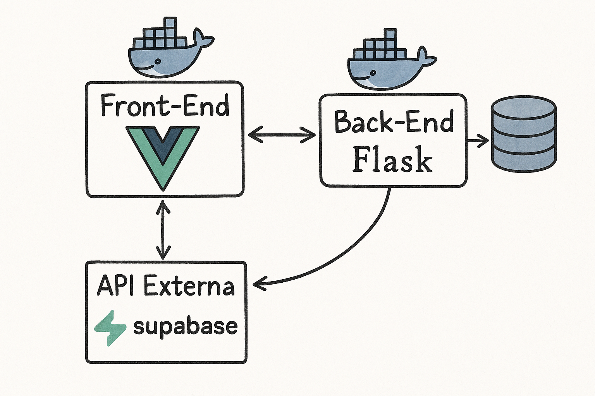

# BuscoEscala v3

**BuscoEscala v3** é uma aplicação composta por dois projetos que funcionam em conjunto: uma **API backend** desenvolvida com **Flask** e um **frontend** em **Vue 3**, ambos orquestrados por **Docker**.

## 🚀 Tecnologias Utilizadas

- **Backend (API)**:
  - [Flask](https://flask.palletsprojects.com/): Framework para construção da API em Python.
  - [Python](https://www.python.org/): Linguagem de programação usada para o desenvolvimento da API.
- **Frontend**:

  - [Vue 3](https://vuejs.org/): Framework progressivo para construção de interfaces de usuário.
  - [Vite](https://vitejs.dev/): Ferramenta de build rápida e moderna para projetos web.

- **Orquestração**:
  - [Docker](https://www.docker.com/): Plataforma para criação, envio e execução de containers.
  - [Docker Compose](https://docs.docker.com/compose/): Ferramenta para definir e executar aplicativos Docker multi-containers.

## 🗂️ Arquitetura da Aplicação

A arquitetura do projeto pode ser visualizada abaixo:




## 📦 Instalação

### **Instalar Dependências**

1. Clone o repositório:

   ```
   git clone https://github.com/vimmasi/buscoescala_v3.git
   ```

2. Navegue até o diretório do projeto:

   ```
   cd buscoescala_v3
   ```

### **Executar Localmente com Docker Compose**

Este repositório já contém o arquivo `docker-compose.yml`, que configura os containers para o frontend (Vue) e backend (Flask) de forma automática.

Para rodar a aplicação localmente com o Docker Compose, basta executar o seguinte comando:

```
sudo docker compose up --build
```

- Caso tenha uma versão antiga do Docker, rode: `sudo docker-compose up --build`

Isso irá:

- Construir e iniciar os containers do frontend (Vue) e backend (Flask).
- A aplicação será acessível em [http://localhost:8080](http://localhost:8080) para o frontend e [http://localhost:5001](http://localhost:5001) para a API (backend).

### **Logando no frontend**

Já existe um usuário cadastrado, para acessar e realizar os testes da aplicação:
- Email: `admin@admin.com`
- Senha: `Admin@123`

### **Parar os Containers**

Para parar os containers que estão rodando, use o comando:

```
sudo docker compose down
```

Isso irá parar e remover todos os containers, redes e volumes definidos no `docker-compose.yml`.

## 🐳 Docker

### **Dockerizando a Aplicação**

Caso queira rodar os containers separadamente, sem usar o `docker-compose.yml`, pode seguir os seguintes passos.

#### **1. Criando a Imagem Docker para a API (Flask)**

Na raiz do projeto, dentro do diretório `buscoescala_api`, execute:

```
sudo docker build -t buscoescala-api ./buscoescala_api
```

#### **2. Criando a Imagem Docker para o Frontend (Vue)**

Na raiz do projeto, dentro do diretório `buscoescala_front_v3`, execute:

```
sudo docker build -t buscoescala-front ./buscoescala_front_v3
```

#### **3. Rodando os Containers**

Depois de construir as imagens, rode os containers:

```
sudo docker run -d -p 5001:5001 buscoescala-api
sudo docker run -d -p 8080:80 buscoescala-front
```

Isso fará com que a aplicação esteja disponível em:

- **Frontend (Vue)**: [http://localhost:8080](http://localhost:8080)
- **Backend (Flask API)**: [http://localhost:5001](http://localhost:5001)

#### **4. Parar os Containers**

Para parar os containers, use:

```
sudo docker stop <CONTAINER_ID>
```

Onde você pode obter o `CONTAINER_ID` com:

```
sudo docker ps
```

Para remover o container depois de parar:

```
sudo docker rm <CONTAINER_ID>
```

Ou para parar e remover de uma vez:

```
sudo docker rm -f <CONTAINER_ID>
```

## 📁 Estrutura do Projeto

O repositório é composto por duas principais pastas, uma para o backend e outra para o frontend:

```
buscoescala_v3/
├── buscoescala_api/
│   ├── app/
│   ├── Dockerfile
│   ├── requirements.txt
│   └── README.md
├── buscoescala_front_v3/
│   ├── public/
│   ├── src/
│   │   ├── assets/
│   │   ├── components/
│   │   ├── views/
│   │   └── main.js
│   ├── Dockerfile
│   └── package.json
├── docker-compose.yml
└── README.md
```

### **docker-compose.yml**

O arquivo `docker-compose.yml` está configurado para orquestrar tanto o frontend quanto o backend.

## 📄 Licença

livre.
